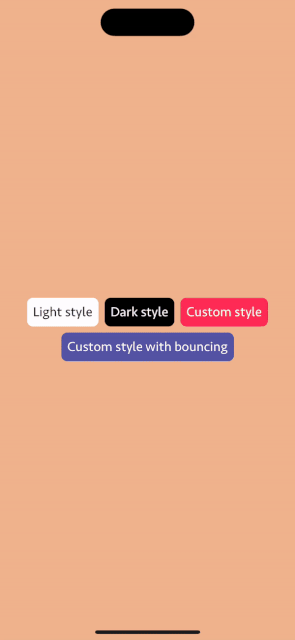

# PopUpMenuSwift

[](https://github.com/apple/swift-package-manager)

Beautiful `PopUpMenuView` that supports portrait and landscape orientation, with flexible view settings.

## Gifs


## Installation
### [Swift Package Manager](https://swift.org/package-manager/)

Going to Xcode `File` > `Add Packages...` and add the repository by giving the URL `https://github.com/bullinnyc/PopUpMenuSwift`  
Enjoy!

## Usage

```swift
import PopUpMenuSwift
```

```swift
// Create any view.
let firstMenuView = Text("Light style")
    .foregroundColor(.black)
    .font(.custom("Seravek", size: 18))
    .padding(8)
    .background(.white)
    .cornerRadius(8)
    
let secondMenuView = Text("Dark style")
    .foregroundColor(.white)
    .font(.custom("Seravek", size: 18))
    .padding(8)
    .background(.black)
    .cornerRadius(8)
    
let thirdMenuView = Text("Custom style")
    .foregroundColor(.white)
    .font(.custom("Seravek", size: 18))
    .padding(8)
    .background(.pink)
    .cornerRadius(8)

// Create names for the dropdown menu.
let menuItems = [
    "First item. Do something on tapped on the item.",
    "Second item",
    "Third item",
    "Fourth item",
    "Fifth item"
]

// PopUp with light style (default).
PopUpMenuView(
    anyView: AnyView(firstMenuView),
    menuItems: menuItems
) { index in
    print("Dropdown index: \(index)")
}

// PopUp with dark style.
PopUpMenuView(
    anyView: AnyView(secondMenuView),
    menuItems: menuItems
) { index in
    print("Dropdown index: \(index)")
}
.popUpMenuStyle(.darkStyle)

// PopUp with custom style.
PopUpMenuView(
    anyView: AnyView(thirdMenuView),
    menuItems: menuItems
) { index in
    print("Dropdown index: \(index)")
}
.popUpMenuStyle(
    .customStyle(
        textColor: .white,
        itemBackgroundColor: .pink,
        backgroundColor: .pink.opacity(0.5)
    )
)
```
**Note:** Two or more `PopUpMenuView` on one screen work as a whole.

### Sets the style of `PopUpMenuView`
**Note:** Default PopUp style is set to `light`. You can try other styles or create your own style.

```swift
.darkStyle
.customStyle
```

## Requirements
- iOS 14.0 +
- [SwiftUI](https://developer.apple.com/xcode/swiftui/)

## License
- PopUpMenuSwift is distributed under the MIT License.
